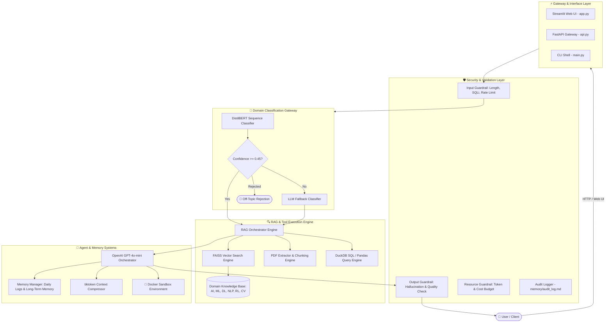

# 🤖 Domain-Specific Educational AI Agent Orchestrator

[](https://www.python.org/downloads/)
[](https://fastapi.tiangolo.com/)
[](https://streamlit.io/)
[](https://pytorch.org/)
[](https://github.com/facebookresearch/faiss)
[](https://openai.com/)
[](https://www.docker.com/)
[](https://opensource.org/licenses/MIT)

An enterprise-grade, high-performance **Domain-Routing RAG (Retrieval-Augmented Generation) Orchestrator** designed for educational Computer Science and AI topics. The system utilizes a fine-tuned **DistilBERT** neural network gateway to route user queries across six distinct technical domains (**AI**, **ML**, **DL**, **NLP**, **RL**, **CV**), performs vector semantic retrieval via **FAISS**, executes natural-language SQL queries over tabular data with **DuckDB**, and synthesizes grounded answers using an **OpenAI LLM Orchestrator** with tool-calling and strict guardrails.

---

## 🌟 Key Features

- 🎯 **Intelligent Domain Routing**: Fine-tuned DistilBERT classifier (`distilbert-base-uncased`) with fallback to LLM classification and confidence floor thresholds ($0.45$) to block off-topic queries.
- 📚 **Multi-Domain RAG Retrieval**: Fast vector semantic search via **FAISS** over domain-structured knowledge bases with dynamic PDF indexing.
- 📊 **Natural Language to SQL**: Query tabular datasets (CSV/Excel) seamlessly using DuckDB & Pandas context execution (`query_csv` tool).
- 📄 **Advanced PDF Context Extractor**: Multimodal PDF parser supporting `pypdf`, `pdfplumber`, form extraction, and OCR fallback (`pytesseract`).
- 🛡️ **Comprehensive Guardrail System**: Multi-layer security featuring SQL injection detection, length constraints, rate limiting, hallucination checking, and cost management.
- 🐳 **Docker Sandbox Execution**: Isolated execution container (`Dockerfile.sandbox`) with non-root access, read-only root filesystems, dropped capabilities, and strict memory limits.
- 🧠 **Persistent Memory & Token Compression**: Dual-layer short-term/long-term memory with automatic `tiktoken`-based context window compression (`threshold_compress`).
- ⚡ **Production FastAPI Service**: Fully asynchronous REST API (`api.py`) exposing health checks, classification, chat pipelines, and document upload endpoints with OpenAPI docs.
- 💻 **Interactive Streamlit Web Dashboard**: Feature-rich visual interface (`app.py`) for real-time chat, vector index browsing, document upload, and debug telemetry.

---

## 📐 System Architecture



---

## 📂 Repository Directory Layout

```
MY_AGENT_APP/
├── api.py                    # FastAPI entrypoint (REST API endpoints & lifespan loading)
├── app.py                    # Streamlit web dashboard interface
├── main.py                   # Command-line interface (CLI) chat orchestrator
├── requirements.txt          # Python dependencies & libraries
├── Dockerfile                # Multi-stage production container setup
├── Dockerfile.sandbox        # Hardened container image for secure sandbox execution
├── data.csv                  # Tabular dataset for natural language SQL queries
│
├── src/                      # Core python application source code
│   ├── classifier.py         # DistilBERT domain classifier wrapper & inference logic
│   ├── domain_agent.py       # Domain-specific prompt & execution agent handlers
│   ├── docker_sandbox.py     # Docker container sandbox wrapper
│   ├── guardrails.py         # Multi-layer input/output/resource guardrails implementation
│   ├── guardrails_config.py  # Guardrail thresholds, regex patterns & cost budgets
│   ├── memory.py             # Short-term daily logs & long-term memory store manager
│   ├── orchestrator.py       # Main RAG orchestrator coordinating tools & OpenAI API
│   ├── query.py              # DuckDB SQL generator & tabular CSV reader
│   ├── retriever.py          # FAISS index builder, text chunker & semantic search engine
│   ├── schemas.py            # Pydantic request & response validation schemas
│   ├── skill_registry.py     # Agent skill registry & menu builder
│   └── token_utils.py        # Token counting (tiktoken) & context window compressor
│
├── scripts/                  # Management & training utilities
│   └── train.py              # PyTorch Hugging Face trainer pipeline for DistilBERT
│
├── skills/                   # Domain skill packages & prompt references
│   └── pdf/                  # PDF extraction skill guidelines & schemas
│
├── tests/                    # Automated testing suite
│   └── test_api.py           # Pytest suite for FastAPI endpoints & guardrails
│
├── memory/                   # Persistent conversation & audit logs
│   ├── long_term_memory.txt  # Long-term agent memory storage
│   └── audit_log.md          # Security audit trail for guardrail violations
│
└── workspace/                # Data storage & model weights
    ├── data/knowledge_base/  # Category folders (AI, ML, DL, NLP, RL, CV)
    └── models/               # Serialized DistilBERT PyTorch weights & FAISS index
```

---

## 🛠️ Installation & Setup

### Prerequisites

- **Python**: Version `3.10` or higher
- **OpenAI API Key**: Required for GPT-4o-mini orchestrator responses
- **Docker** *(Optional)*: Required only for sandbox execution or containerized deployment

### 1. Clone the Repository & Navigate to Workspace

```bash
git clone https://github.com/your-username/app.git
cd app/MY_AGENT_APP
```

### 2. Set Up Virtual Environment

```bash
# Windows
python -m venv venv
venv\Scripts\activate

# Linux / macOS
python3 -m venv venv
source venv/bin/activate
```

### 3. Install Dependencies

```bash
pip install --upgrade pip
pip install -r requirements.txt
```

### 4. Configure Environment Variables

Create a `.env` file inside `MY_AGENT_APP/`:

```env
OPENAI_API_KEY=your-actual-openai-api-key
OPENAI_MODEL=gpt-4o-mini
DISTILBERT_MODEL_DIR=workspace/models/distilbert_model
DOMAIN_CONFIDENCE_FLOOR=0.45
KNOWLEDGE_BASE_DIR=workspace/data/knowledge_base
MEMORY_DIR=memory
```

---

## 🚀 Execution & Usage Guide

### 1. Run the FastAPI REST Backend

Start the Uvicorn web server to serve API requests:

```bash
uvicorn api:app --reload --port 8000
```
- Interactive API Documentation (Swagger UI): `http://localhost:8000/docs`
- Health Check: `http://localhost:8000/health`

### 2. Run the Streamlit Interactive Web Interface

Launch the frontend dashboard:

```bash
streamlit run app.py
```
- Open `http://localhost:8501` in your browser to interact with the full web interface.

### 3. Run via Command-Line Interface (CLI)

Interactive terminal chat mode:

```bash
python main.py
```

### 4. Train / Fine-Tune the DistilBERT Domain Classifier

Train the DistilBERT sequence classifier on your dataset:

```bash
python scripts/train.py --data_path data.csv --epochs 3 --batch_size 16
```

---

## 📡 API Endpoints Reference

| Endpoint | Method | Description |
| :--- | :---: | :--- |
| `/health` | `GET` | Returns API status, classifier loading status, indexed vector chunk count, and OpenAI connection |
| `/classify` | `POST` | Classifies a query into a target domain (`AI`, `ML`, `DL`, `NLP`, `RL`, `CV`) with confidence score |
| `/chat` | `POST` | Full RAG pipeline: domain routing, FAISS context search, memory lookup, and LLM grounded generation |
| `/upload` | `POST` | Uploads a PDF document to a domain subfolder, chunks & embeds content, and updates FAISS index |

### Sample Requests & Responses

#### 🔹 1. Domain Classification (`POST /classify`)

**Request:**
```bash
curl -X POST "http://localhost:8000/classify" \
     -H "Content-Type: application/json" \
     -d '{"query": "What is backpropagation and gradient descent in deep neural networks?"}'
```

**Response:**
```json
{
  "query": "What is backpropagation and gradient descent in deep neural networks?",
  "domain": "DL",
  "confidence": 0.9421,
  "backend": "distilbert"
}
```

#### 🔹 2. Chat Orchestration (`POST /chat`)

**Request:**
```bash
curl -X POST "http://localhost:8000/chat" \
     -H "Content-Type: application/json" \
     -d '{"query": "Explain how Q-learning works in Reinforcement Learning", "session_id": "session-101"}'
```

**Response:**
```json
{
  "query": "Explain how Q-learning works in Reinforcement Learning",
  "domain": "RL",
  "confidence": 0.9104,
  "answer": "Q-learning is a model-free reinforcement learning algorithm used to learn the value of an action in a particular state...",
  "sources": [
    "workspace/data/knowledge_base/RL/q_learning_notes.pdf"
  ]
}
```

---

## 🛡️ Guardrails & Security Specifications

The system incorporates a robust production guardrail pipeline (`src/guardrails.py`):

1. **Input Guardrail**:
   - Enforces length limits ($10 \le \text{length} \le 1000$ chars).
   - Sanitizes SQL injection & code injection patterns (`DROP`, `UNION`, `--`, `OR 1=1`).
   - Applies sliding window rate limiting per user ($10$ requests / minute).
2. **Output Guardrail**:
   - Scans generated outputs for overconfident hallucination phrases (*e.g.*, "I am 100% certain", "guaranteed to work").
   - Evaluates relevance and clarity threshold scores.
3. **Resource Guardrail**:
   - Tracks token consumption dynamically against monthly token and budget limits ($10,000$ tokens / $\$50.00$ USD).
4. **Docker Sandbox Hardening**:
   - Runs code inside restricted containers using non-root user (`USER agent`).
   - Mounted with read-only root filesystems and `--cap-drop ALL`.
   - Strict memory ceiling ($256\text{MB} - 512\text{MB}$) and network isolation.

---

## 🧪 Testing

Run the automated test suite with `pytest`:

```bash
pytest tests/test_api.py -v
```

---

## 🐳 Docker Deployment

Build and launch the complete service inside Docker:

```bash
# Build production image
docker build -t edu-agent-app .

# Run FastAPI backend container
docker run -d -p 8000:8000 --env-file .env --name edu-agent-api edu-agent-app
```

---

## 🛠️ Technology Stack

| Domain | Technologies |
| :--- | :--- |
| **Language & Core** | Python 3.10+, PyTorch, Hugging Face `transformers` |
| **Web Server & UI** | FastAPI, Uvicorn, Streamlit, Pydantic |
| **Vector DB & Retrieval** | FAISS (`faiss-cpu`), Sentence Transformers, `pypdf`, `pdfplumber` |
| **Data Engine** | DuckDB, Pandas, OpenPyXL |
| **Orchestrator & LLM** | OpenAI API (`gpt-4o-mini`), `tiktoken` |
| **Security & Sandbox** | Custom Guardrails, Docker Container Isolation |
| **Testing** | Pytest, TestClient |

---

## 📜 License

This project is licensed under the **MIT License** - see the [LICENSE](LICENSE) file for details.
