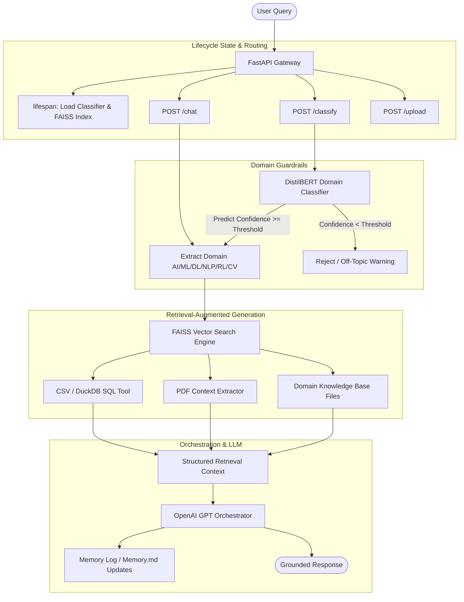

# 🤖 Domain-Specific Educational AI Agent Orchestrator

A professional, high-performance domain-routing RAG orchestrator system. The application uses a fine-tuned **DistilBERT** classification model as an intelligent gateway to route questions to the correct domain context, retrieves matching documents using **FAISS vector search**, and uses an **OpenAI LLM** orchestrator agent to generate grounded educational answers.

---

## 📐 System Architecture



---

## 🗺️ Roadmap & Milestones

The project is structured into **10 core milestones**:

* **✅ Milestone 1: Dataset Preparation**
  * Curated question-domain classification datasets mapped to `AI`, `ML`, `DL`, `NLP`, `RL`, and `CV`.
* **✅ Milestone 2: Model Fine-Tuning**
  * Train and evaluate a local DistilBERT sequence classifier (`distilbert-base-uncased`) achieving ~70% accuracy, outputting PyTorch weights and label encoder serialization.
* **🔜 Milestone 3: Reusable Python Modules**
  * Convert Colab notebook training cells into standalone modules:
    * `train.py`: Command-line interface to train and save the classifier.
    * `classifier.py`: Production-grade wrapper for CPU/GPU model loading and inference.
* **🔜 Milestone 4: FastAPI Web Server**
  * Create the backend web server skeleton `api.py` with standard configurations, custom error handlers, request validation schemas, and health endpoints.
* **🔜 Milestone 5: Classifier Integration**
  * Load the DistilBERT model once on startup using FastAPI's `lifespan` event and expose a POST `/classify` route.
* **🔜 Milestone 6: PDF Upload Functionality**
  * Build a POST `/upload` API endpoint that receives, parses, chunks, and prepares PDF documents for indexing.
* **🔜 Milestone 7: FAISS Vector Database**
  * Build a retrieval engine `retriever.py` utilizing the FAISS library to index and search chunked text files using semantic embeddings.
* **🔜 Milestone 8: Orchestrator Agent**
  * Create the core orchestrator module `orchestrator.py` that coordinates classification, vector search, tabular querying, memory logs, and guardrails.
* **🔜 Milestone 9: LLM Answer Generation**
  * Connect the orchestrator with OpenAI's Chat Completion API, formatting system/user instructions with context logs.
* **🔜 Milestone 10: Dockerization & Deployment**
  * Write a multi-stage `Dockerfile` and setup deployment scripts to package the API and frontend into lightweight container environments.

---

## 📂 Directory Layout

* 📁 `skills/` - Custom prompt/tool descriptions utilized by the agent loop.
* 📁 `workspace/data/knowledge_base/` - Source documents categorized by domain folders (`AI`, `CV`, etc.).
* 📄 `train.py` - Script to train, validate, and save the DistilBERT classifier.
* 📄 `classifier.py` - Single-point wrapper class for DistilBERT inference.
* 📄 `retriever.py` - Text chunker and FAISS vector search database indexer.
* 📄 `orchestrator.py` - Agent logic orchestrating classifiers, memory, and LLMs.
* 📄 `api.py` - FastAPI entry point exposing chat, classification, and upload routes.
* 📄 `app.py` - Interactive Streamlit UI communicating with the FastAPI gateway.
* 📄 `requirements.txt` - Python project dependencies.
* 📄 `AGENTS.md` - Agent guidelines, memory logs, and repository practices.

---

## 🛠️ Setup & Operations

### 1. Installation
Ensure Python 3.10+ is installed. Create a virtual environment and install the requirements:

```bash
python -m venv venv
# Windows
venv\Scripts\activate
# Linux/macOS
source venv/bin/activate

pip install -r requirements.txt
```

### 2. Environment Configurations
Create a `.env` file in the root directory:

```env
OPENAI_API_KEY=your-openai-api-key
OPENAI_MODEL=gpt-4o-mini
DISTILBERT_MODEL_DIR=workspace/models/distilbert_model
DOMAIN_CONFIDENCE_FLOOR=0.45
KNOWLEDGE_BASE_DIR=workspace/data/knowledge_base
```

### 3. Running Model Training (Milestone 3)
To train the classifier on your dataset:

```bash
python train.py --data_path path/to/dataset.csv --epochs 3 --batch_size 16
```

### 4. Running the FastAPI Backend (Milestone 4 & 5)
Start the Uvicorn web server locally:

```bash
uvicorn api:app --reload --port 8000
```

### 5. Running the Streamlit Frontend
Start the web interface client:

```bash
streamlit run app.py
```

### 6. Testing
Run automated endpoint validation suites:

```bash
pytest test_api.py
```
